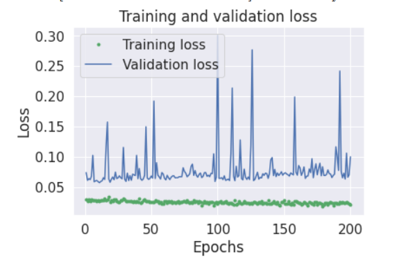
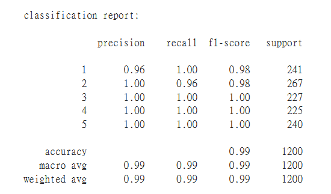

# Tensorflow_MachineLearning
 read csv file which stores accelerometer and gyroscope data from IMU sensor of  Arduino Nano 33 Sense, and do basic machine learning training and testing, with accuracy of 99%.

csv file labels indicates postures of the Arduino board
 
	1 -> supine
	 
	2 -> prone
	 
	3 -> side
	 
	4 -> sitting
	 
	5 -> unknown

 

 
confusion matrix
 

 
